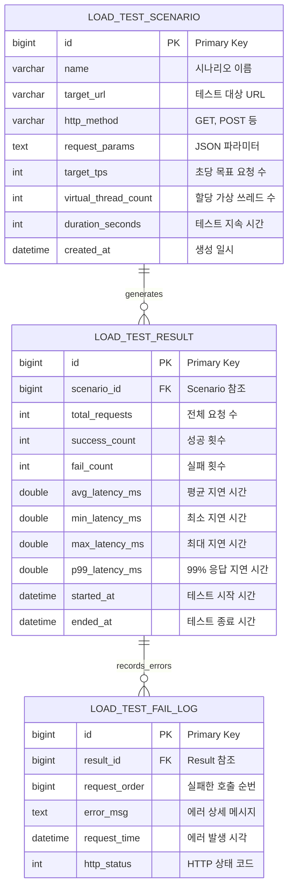

# 🚀 Java-LoadTester: Virtual Thread Based Load Generator

Java 21의 가상 쓰레드(Virtual Threads)를 활용하여 고효율의 HTTP 부하를 생성하고,
시스템의 성능 임계점을 측정 및 분석하는 오픈소스 프로젝트입니다.

---

## 💡 프로젝트 핵심 가치 (Core Values)

1.  **High Throughput**: 가상 쓰레드를 활용하여 최소한의 리소스로 수만 개의 동시 연결 시뮬레이션 가능.
2.  **Detailed Tracking**: 단순 통계를 넘어 모든 실패 요청에 대한 순번과 에러 로그를 기록하여 장애 원인 분석 지원.
3.  **Data Persistence**: 테스트 설정과 결과를 DB에 저장하여 과거 성능 이력을 체계적으로 관리.

---

## 🛠 Tech Stack

- **Language**: Java 21 (JDK 21)
- **Framework**: Spring Boot 3.2+
- **Concurrency**: Virtual Threads (Project Loom)
- **Persistence**: MyBatis, MySQL 8.0
- **Environment**: Docker, Docker Compose

---

## 📊 Database Architecture

대용량 트래픽 결과 저장을 고려하여 **요약 통계**와 **상세 에러 로그**를 분리 설계했습니다.


### ERD Structure
- **load_test_scenario**: 테스트를 위한 설정값(Target URL, TPS, 쓰레드 수 등) 저장.
- **load_test_result**: 테스트 종료 후 집계된 최종 성능 지표(P99 Latency, 성공률 등) 저장.
- **load_test_fail_log**: 분석을 위해 실패한 개별 호출의 순번(`request_order`)과 에러 상세 사유 기록.



---

## ⚙️ Infrastructure Setup (Docker)

프로젝트 루트에서 단 한 줄의 명령어로 DB 환경 구축 및 전용 계정 권한 설정이 완료됩니다.

```bash
# 컨테이너 실행 및 초기화 스크립트(init.sql) 자동 실행
docker-compose up -d

```
